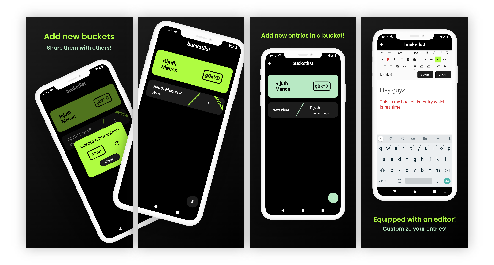

# Bucketlist
Bucketlist is an android app built with Flutter to allow you to create sharable buckets with your friends! Now you can plan events, activites and many more using our easy-to-use editor, all in realtime!

# How do I use it?

To get started, download the app here.

- Once you've downloaded the app, you can create and share a bucket with your friend!
- Now you and your friends can add different entries in the bucket using our easy-to-use editor!
- All changes are synced in realtime :)

# Contact
For any queries or feedback please do not hesitate to contact [markisdev@gmail.com](mailto:markisdev@gmail.com)

# Screenshots

